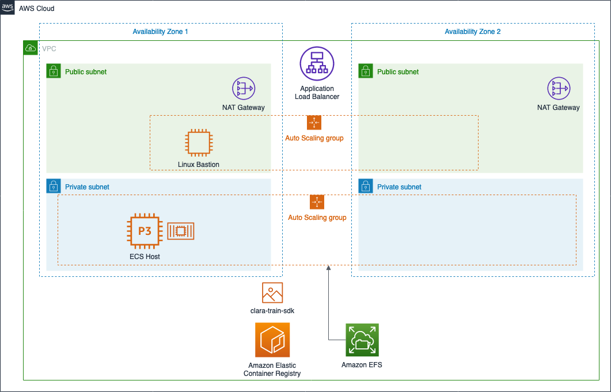

# quickstart-nvidia-clara-medical-imaging
## NVIDIA Clara Train SDK for Medical Imaging on the AWS Cloud

This Quick Start deploys the Clara Train SDK as a highly available service, based on Amazon Elastic Container Service (Amazon ECS).

## Overview

The [NVIDIA Clara Train SDK](https://docs.nvidia.com/clara/) includes AI-Assisted Annotation APIs and Annotation server that can be seamlessly integrated into any medical viewer making them AI capable. The training framework includes decentralized learning techniques like federated learning and transfer learning. The SDK also makes available model applications packaged as MMARS (Medical Model ARchive) available to users, providing an intuitive config based environment for data scientists and researchers to get kick-started with AI development.

This Quick Start offers two deployment options:

- Deploying NVIDIA Clara Train SDK into a new virtual private cloud (VPC) on AWS
- Deploying NVIDIA Clara Train SDK into an existing VPC on AWS

You can also use the AWS CloudFormation templates as a starting point for your own implementation.

After the CloudFormation templates have been deployed, the [stack outputs](http://docs.aws.amazon.com/AWSCloudFormation/latest/UserGuide/outputs-section-structure.html) contain a link to the load-balanced URL for the AI-Assisted Annotation APIs and Annotation Server, and the DNS name of the Amazon Elastic File System (Amazon EFS).

The command line Clara SDK tools can be used by SSH, via the bastion host, to the ECS host.  Then, opening a shell to the Clara container running on the ECS host.

For architectural details, best practices, step-by-step instructions, and customization options, see the 
[deployment guide](https://aws-quickstart.s3.amazonaws.com/quickstart-nvidia-clara-medical-imaging/doc/nvidia-clara-medical-imaging-on-the-aws-cloud.pdf).

To post feedback, submit feature ideas, or report bugs, use the **Issues** section of this GitHub repo.
If you'd like to submit code for this Quick Start, please review the [AWS Quick Start Contributor's Kit](https://aws-quickstart.github.io/). 